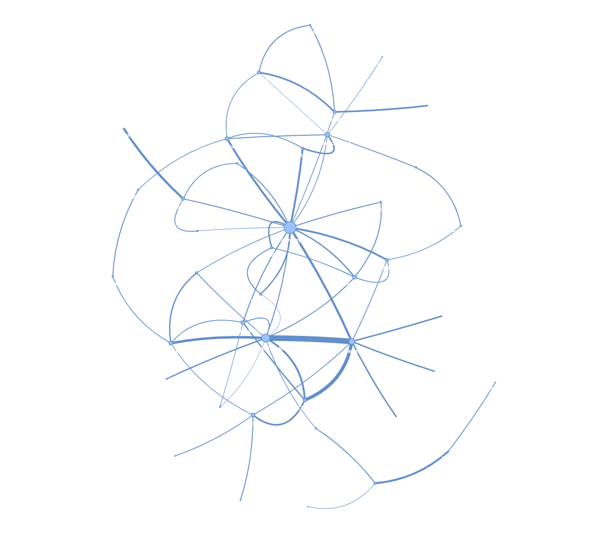
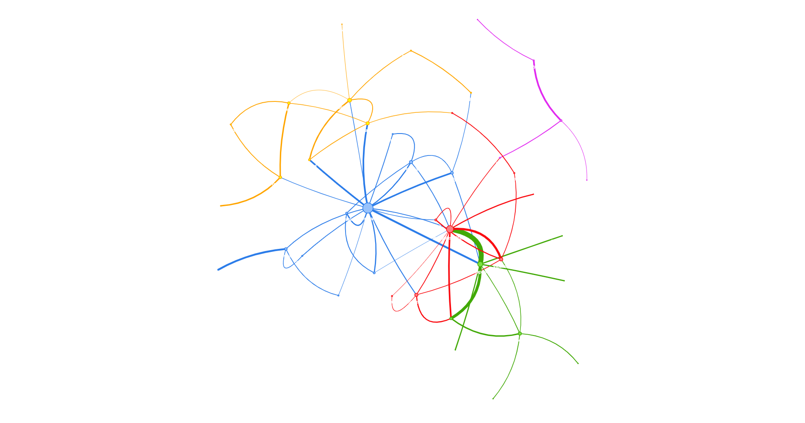
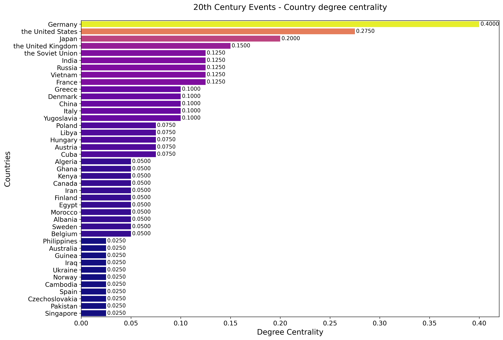
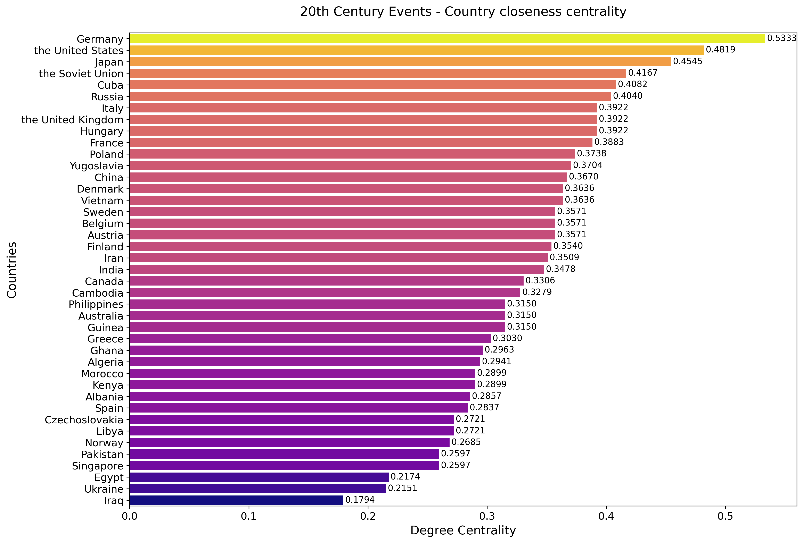
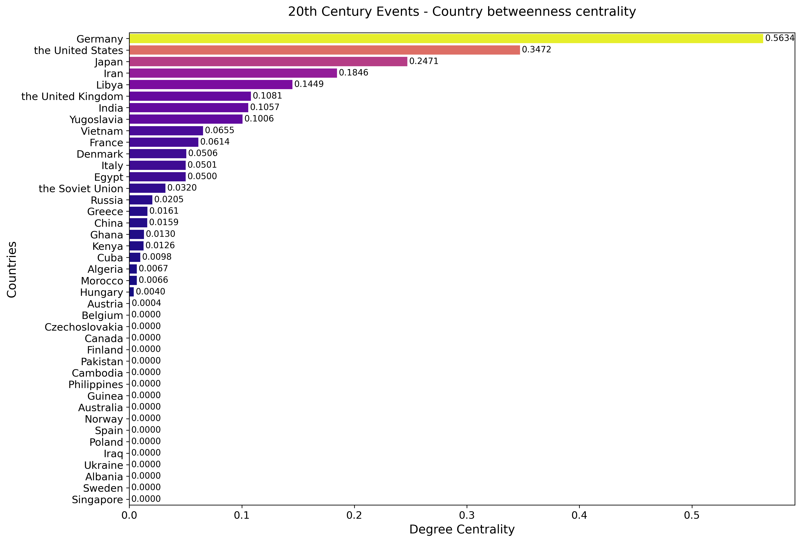

## Network Visualizations - 20th century

### 1. Graph visualization - Pyvis:

### 2. Community Detection - Leiden Algorithm:
 

 #### Observations:
The partition makes sense based on historical geopolitical relationships. Here are some notable observations:

##### Blue Cluster (Germany and its connections):

Countries like Germany, Austria, Hungary, and Italy are grouped together. This reflects the historical alliances during the 20th century, including World War I and World War II. The Axis Powers (Germany, Italy, and Japan) were key players in this network, though Japan might be placed in another cluster due to its geographical and regional ties.

##### Red Cluster (United States and Asia):

The United States is linked with Vietnam, Cambodia, and China, which mirrors its involvement in the Vietnam War, Cold War tensions, and its complex relationship with China.

##### Green Cluster (Colonial and Southeast Asia):
Countries like Philippines, Singapore, and Australia are grouped together, possibly due to their ties as former colonies and shared interactions with major powers like the United States and the UK.

##### Orange Cluster (Eastern Europe and North Africa):

Countries like Poland, Yugoslavia, and Czechoslovakia are grouped, which aligns with their shared history under Soviet influence during the Cold War.
These countries were part of the Eastern Bloc, heavily influenced by the USSR. But I can't find the reason why North african countries are in this specific Cluster. 

##### Purple Cluster (Middle East ):

Countries like Egypt, Libya, and Iran are connected, representing shared historical events, such as the rise of nationalism, decolonization, and Cold War involvement in the region.

### 3. Analyzing Country Centrality in 20th Century Events:
 **A. DEGREE CENTRALITY:**
 

**B. CLOSENESS CENTRALITY:**
 

**C. BETWEENNESS CENTRALITY:**
 

#### Observations:
Germany and the United States have the highest closeness centrality scores, highlighting their central positions in the network. This means they can reach other countries in the network with fewer intermediary connections, demonstrating their importance in facilitating global interactions.
The Soviet Union, Japan, and Cuba also rank highly, reflecting their strategic roles during major geopolitical events such as the Cold War and post-colonial transformations.
Countries with lower closeness centrality (e.g., Iraq, Ukraine, and Spain) are more peripheral, with limited direct influence on global networks.

## Conclusions About the Connections Between Communities:
The edges connecting different clusters highlight major geopolitical events where countries from different spheres interacted. For example, the connections between the United States (red cluster) and countries in the blue cluster reflect alliances and conflicts during the Cold War.
Connections between the Middle East (purple cluster) and Western powers signify their role in oil politics, wars, and global diplomacy.

The clustering aligns with historical blocs such as:
Western Bloc (USA and Allies)
Eastern Bloc (USSR and Eastern Europe)
Decolonizing Nations (Asia, Middle East, and Africa)

Sparse Connections in Peripheral Nodes:

Countries like Libya, Norway, and Singapore are peripheral, reflecting their smaller roles in global conflicts but significant regional importance.

Colonial and Decolonization Themes:

Many connections can be tied back to colonial histories and the eventual push for independence, which shaped alliances and conflicts throughout the 20th century.

Germany leads in direct connections, reflecting its significant involvement in bilateral relations during the 20th century, particularly within Europe and beyond.
The United States and Japan also score highly, showcasing their extensive ties across continents due to their economic, military, and political influence.
Countries such as India and the Soviet Union exhibit notable degree centrality, underlining their roles as regional and global powers during key historical periods.
Lower-ranked countries, like Singapore and Cambodia, have fewer direct connections, indicating a more localized or limited role in the global network.

**The partition aligns well with historical narratives, but it also reveals new patterns of interaction.** For instance:

The growing role of Asia-Pacific nations in global networks.
How major powers like the United States, Germany, and USSR acted as bridges between different communities. These insights can guide further analysis, such as examining which countries acted as mediators or outliers in historical conflicts and alliances.
